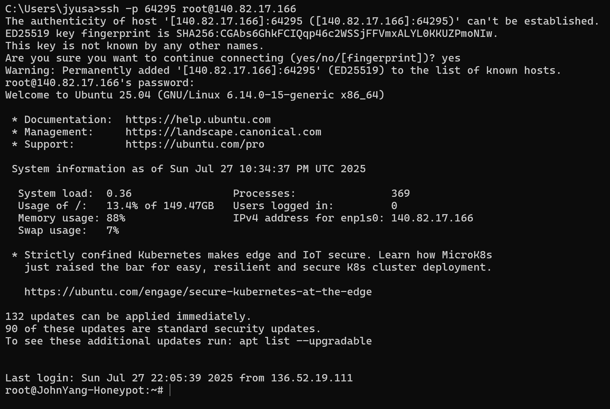

# Honeypot Installation - John Yang

## Objective

This project is goes through the process of deploying a cloud-based honeypot environment for threat intelligence using Vultr and T-Pot on Ubuntu to capture and analyze real-time attacker activities. After setting up the honeypot, collect and visualize attack data through the ELK stack to derive further insights for incident response and defensive strategies, providing essential hands-on exposure to real attacker behaviors in uncontrolled environments.

### Skills Learned

- Developed cloud infrastructure security skills by deploying Ubuntu VMs on Vultr and configuring firewall isolation for honeypot containment.  
- Gained threat intelligence platform experience by operating T-Pot's multi-honeypot environment to capture various information about attackers.  
- Strengthened threat analysis proficiency by identifying attacker TTPs and IoCs.

### Tools Used

- Vultr (Cloud Infrastructure) for deploying Ubuntu virtual machines with isolated network environments.  
- Ubuntu (Server OS) as the secure base operating system for hosting the honeypot platform.  
- T-Pot (Multi-Honeypot Platform) for deploying honeypots to capture live threat activities.  
- ELK Stack (Elasticsearch, Logstash, Kibana) for processing and visualizing attacker behaviors through custom dashboards.  
- Linux CLI for server configuration and setup.

## Steps

### Part 1: Setting up the Virtual Machine

Welcome! We will be installing a honeypot (T-Pot) on an Ubuntu server and monitoring the results!

I'll be using Vultr to set up the virtual machine, but you can use any cloud provider of your choice.

Note that T-Pot requires a minimum of 8GB RAM and 128GB of storage space.

Spin up your virtual machine!

Since we have our virtual machine now, let's set some firewall rules.

I added two rules to first accept all TCP and UDP traffic from my IP address.

Make sure to apply the firewall group to the virtual machine.

After we set up our honeypot, we will be changing these rules to put our server out in the wild.

### Part 2: Installing T-Pot

Now, let's SSH into our machine to make some necessary changes.

T-Pot's installation process requires it to be run on a non-root account that is in the sudo group.

Lets first create a new user.

Then, add the newly created user to the sudo group.

Then, switch to the new account, and run the installer.

`env bash -c "$(curl -sL https://github.com/telekom-security/tpotce/raw/master/install.sh)"`

The installation is done!

We must reboot Ubuntu after the installation has been completed.

Note that the port to SSH in the machine will be changed to 64295.

We can now log into the web interface for T-Pot using our machine IP and port 64297.

We will primarily be looking at the Attack Map and Kibana.

Lets see what the Attack Map looks like.

We don't see any activity yet, but this is because of our firewall rules.

It's time to open our server up to the entire world!

Lets add three rules. For the T-Pot ports that we will need access to, set the access to only our IP address.

However, for TCP and UDP, accept traffic from any IP address and to any port.

We should start receiving attacks soon.

Nice! This shows that our firewall rules have been applied.

To get some more data in, I wanted about a day to check in again with the server. Here's how it looks!

Wow, 38k attacks! The world really wants our server.

Let's take a look at Kibana, a part of the Elastic Stack.

We can get more detailed insights about the attacks that we received here.

Here, we can see how much of attacks that our individual honeypots received. 

A lot of people are trying to attack with SSH and Telnet, seeing that the most amount of attacks (17k) was received by Cowrie. 

There is also a histogram of Attacks vs Unique Source IPs.

We can also see a different view of the Attack Map. Lots of attacks from the Dutch and the Americans!

Here is the next part.

One thing that surprised me was the sheer amount of attacks with the destination port of 5060, even more than port 22 (SSH) or 443 (HTTPS).

Port 5060 is used for Session Initiation Protocol (SIP) signaling in VoIP (Voice over Internet Protocol) systems.

And with the amount of attacks having been executed within such a small period of time, we can infer that there were a lot of DDoS attempts trying to exploit VoIP. Cool!

We can also view the reputations the IP addresses we caught. The vast majority of IP addresses are actually known as attackers.

Additionally, we can see that most attacks were carried over through Linux distributions.

Next!

We can see that different countries (the top 5 most attacked) have different tendencies in their attacks.

The US and France most frequently used SIP, the Netherlands used HTTP, and Vietnam and China used SSH as their main methods.

Looking at the Suricata Alert Category Histogram, what on earth happened at 11PM on July 27th?

Lets dive slightly deeper. 

From a slight analysis, it seems like the attacker executed a packet flood on port 80 using malformed/truncated packets, generating a flurry of "SURICATA AF-PACKET truncated packet" alert signature keywords. 

It might be targetting the monitoring system, Suricata, rather than our actual servers. Cool!

Lets look at the next part.

Here we see a log of all attempted login details, both username and password.

As expected, root is the most used username.

For the passwords, we see passwords that have likely been used in the form of a brute-force attack, and also some passwords that specifcally target weak default credentials.

Change those default credentials!!!

There are also some funny ones. Some script kiddies might have found our server.

"FattMan1234567890", "M3gaP33!"? Are we serious right now? 😂

Lets move on to the final section of the Kibana interface.

This section contains extremely useful details for further investigation.

First we have the most common Autonomous System Numbers (ASNs).

Then the Attacker Source IPs, which we can easily click on each of them and look at further information.

Lets look at the IP we received the most attacks from. Good old reliable OSINT!

The Dutch really went for it.

Finally, we can identify common attacks by CVE listings and Suricata Alert Signatures.

Really cool!

## Conclusion

This project was my first exposure to real attacker activities, and I was extremely engaged by capturing and analyzing them. Managing the entire process from configuring firewalls (so that everyone could get in!), watching thousands of attacks carry out, to analyzing ELK dashboards taught me how chaotic yet valuable real-world threat monitoring can be. Trying to connect scattered events into coherent patterns really pushed me to think like a security analyst. Most importantly, this also transformed my theoretical knowledge of honeypots into concrete skills in threat intelligence, showing me how security teams transform raw attack data into actionable defense strategies. Thank you for reading!

## Contact

Email: <johnyang4406@gmail.com>, <john_s_yang@brown.edu>

LinkedIn: <https://www.linkedin.com/in/john-yang-747726292/>
